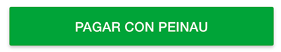

## Peinau Checkout Button




### Before you start

#### Create a Peinau App

1. Go to https://quickpay-connect-checkout-web.azurewebsites.net/#!/app/applications
2. Log in to the site with your Peinau credentials
3. Follow the instructions to create a new app
4. Make a note of your **Client ID** and **Client Secret** for both **Sandbox** and **Production**.

#### Add the Peinau Checkout Integration Script

Add the following to your html page:

```html
<script src="https://www.peinau.com/api/peinau.v1.js"  data-version-1></script>
```
### Basic Integration

This integration lets you specify all of your payment parameters all at once, to render a button onto the page.


With this integration:
- We set up the `payment` method to call our web-server, which then calls the Peinau REST API to **create** a Payment ID.
- We listen for `onAuthorize`, wich indicates if the payments was success or rejected by the gateway

You'll need:
- Your **Client ID**.
- Your **Payment Details** (see [Dev Portal](https://quickpay-connect-checkout-web.azurewebsites.net/#!/docs/api-docs/express-checkout/payments/create-intention) for the expected json structure)
- An **HTML Container Element** to render the button into

```javascript
<div id="my-button-element"></div>

<script>

    Peinau.Button.render({

        // Set up a getter to create a Payment ID using the payments api, on your server side:
        payment: function() {
            return new Peinau.Promise(function(resolve, reject) {

                // Make an ajax call to get the Payment ID. This should call your back-end,
                // which should invoke the Peinau Payment Create api to retrieve the Payment ID.

                // When you have a Payment ID, you need to call the `resolve` method, e.g `resolve(data.paymentID)`
                // Or, if you have an error from your server side, you need to call `reject`, e.g. `reject(err)`

                http.post('/your-api/create-payment')
                    .done(function(data) { resolve(data.paymentID); })
                    .fail(function(err)  { reject(err); });
            });
        },

        // Pass a function to be called when the customer approves the payment,
        // then call execute payment on your server:

        onAuthorize: function(data) {

            console.log('The payment was authorized!');
            console.log('Payment ID = ',   data.paymentID);
            console.log('PayerID = ', data.payerID);

            // At this point, the payment has been authorized.
            if(data.paymentSuccess){
                /* Go to a success page */
            }else{
                /* Go to an error page  */
            }

        },

        // Pass a function to be called when the customer cancels the payment

        onCancel: function(data) {

            console.log('The payment was cancelled!');
            console.log('Payment ID = ', data.paymentID);
        }

    }, '#my-button-element');
</script>
```

### Customizing the Button

You can change the look and feel of the button, using the `style` parameter, and language of the button using `locale` parameter:

```javascript
Peinau.Button.render({

    ...
    // Specify the language displayed on your button
    locale: 'es-CL',

    // Specify the style of your button

    style: {
        size:   'medium', // tiny, small, medium
        color:  'orange', // orange, blue, silver
        shape:  'pill'    // pill, rect
    }

}, '#my-button-element');
```